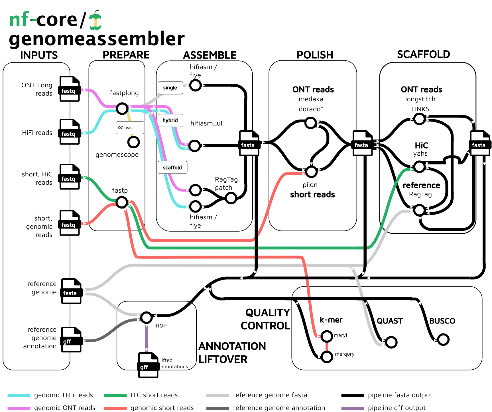

<h1>
  <picture>
    <source media="(prefers-color-scheme: dark)" srcset="docs/images/nf-core-genomeassembler_logo_dark.png">
    
  </picture>
</h1>

[](https://github.com/codespaces/new/nf-core/genomeassembler)
[](https://github.com/nf-core/genomeassembler/actions/workflows/nf-test.yml)
[](https://github.com/nf-core/genomeassembler/actions/workflows/linting.yml)[](https://nf-co.re/genomeassembler/results)[](https://doi.org/10.5281/zenodo.14986998)
[](https://www.nf-test.com)

[](https://www.nextflow.io/)
[](https://github.com/nf-core/tools/releases/tag/3.5.1)
[](https://docs.conda.io/en/latest/)
[](https://www.docker.com/)
[](https://sylabs.io/docs/)
[](https://cloud.seqera.io/launch?pipeline=https://github.com/nf-core/genomeassembler)

[](https://nfcore.slack.com/channels/genomeassembler)[](https://bsky.app/profile/nf-co.re)[](https://mstdn.science/@nf_core)[](https://www.youtube.com/c/nf-core)

## Introduction

**nf-core/genomeassembler** is a bioinformatics pipeline that carries out genome assembly, polishing and scaffolding from long reads (ONT or pacbio). Assembly can be done via `flye` or `hifiasm`, or combinations of both, polishing can be carried out with `medaka` (ONT), `dorado` (ONT only, experimental) or `pilon` (requires short-reads), and scaffolding can be done using `LINKS`, `Longstitch`, both using long-reads, `yahs` if HiC reads are availble, or `RagTag` if a reference is available. Quality control includes `BUSCO`, `QUAST` and `merqury` (requires short-reads).
Currently, this pipeline does not implement phasing of polyploid genomes.

<picture>
  <source media="(prefers-color-scheme: dark)" srcset="docs/images/genomeassembler.dark.png">
  
</picture>

## Usage

> [!NOTE]
> If you are new to Nextflow and nf-core, please refer to [this page](https://nf-co.re/docs/get_started/environment_setup/overview) on how to set-up Nextflow. Make sure to [test your setup](https://nf-co.re/docs/get_started/run-your-first-pipeline) with `-profile test` before running the workflow on actual data.

nf-core/genomeassembler can be set up via pipeline parameters, or via a samplesheet, or a combination of both. For more details and further functionality, please refer to the [usage documentation](https://nf-co.re/genomeassembler/usage) and the [parameter documentation](https://nf-co.re/genomeassembler/parameters).

The pipeline can be run with a test-profile via:

```bash
nextflow run nf-core/genomeassembler \
   -profile test,<docker/singularity/.../institute> \
```

> [!WARNING]
> Please provide pipeline parameters via the CLI or Nextflow `-params-file` option. Custom config files including those provided by the `-c` Nextflow option can be used to provide any configuration _**except for parameters**_; see [docs](https://nf-co.re/docs/usage/getting_started/configuration#custom-configuration-files).

For more details and further functionality, please refer to the [usage documentation](https://nf-co.re/genomeassembler/usage) and the [parameter documentation](https://nf-co.re/genomeassembler/parameters).

## Pipeline output

To see the results of an example test run with a full size dataset refer to the [results](https://nf-co.re/genomeassembler/results) tab on the nf-core website pipeline page.
For more details about the output files and reports, please refer to the
[output documentation](https://nf-co.re/genomeassembler/output).

## Credits

nf-core/genomeassembler was written, and is currently maintained by [Niklas Schandry](https://github.com/nschan), of the Faculty of Biology of the Ludwig-Maximilians University (LMU) in Munich, Germany, with funding support from the German Research Foundation (Deutsche Forschungsgemeinschaft [DFG], via Transregional Research Center TRR356 grant 491090170-A05 to Niklas Schandry).

I thank the following people for constructive reviews and discussion during the development of this pipeline:

- [Jim Downie](https://github.com/prototaxites)
- [Mahesh Binzer-Panchal](https://github.com/mahesh-panchal)
- [Matthias Hörtenhuber](https://github.com/mashehu)
- [Evangelos Karatzas](https://github.com/vagkaratzas)
- [Louis Le Nézet](https://github.com/LouisLeNezet)
- [Júlia Mir Pedrol](https://github.com/mirpedrol)
- [Daniel Straub](https://github.com/d4straub)

## Contributions and Support

If you would like to contribute to this pipeline, please see the [contributing guidelines](docs/CONTRIBUTING.md).

For further information or help, don't hesitate to get in touch on the [Slack `#genomeassembler` channel](https://nfcore.slack.com/channels/genomeassembler) (you can join with [this invite](https://nf-co.re/join/slack)).

## Citations

If you use nf-core/genomeassembler for your analysis, please cite it using the following doi: [10.5281/zenodo.14986998](https://doi.org/10.5281/zenodo.14986998)

An extensive list of references for the tools used by the pipeline can be found in the [`CITATIONS.md`](CITATIONS.md) file.

You can cite the `nf-core` publication as follows:

> **The nf-core framework for community-curated bioinformatics pipelines.**
>
> Philip Ewels, Alexander Peltzer, Sven Fillinger, Harshil Patel, Johannes Alneberg, Andreas Wilm, Maxime Ulysse Garcia, Paolo Di Tommaso & Sven Nahnsen.
>
> _Nat Biotechnol._ 2020 Feb 13. doi: [10.1038/s41587-020-0439-x](https://dx.doi.org/10.1038/s41587-020-0439-x).
